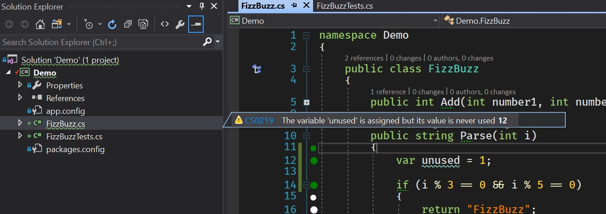

# Know your IDE - Visual Studio

Warum? Man verbringt 8h am Tag in der IDE! Es lohnt sich, ein paar Kniffe drauf zu haben.

<!-- TOC depthFrom:2 -->

- [Das A und O: Keyboard Shortcuts](#das-a-und-o-keyboard-shortcuts)
    - [Visual Studio: Basic Keyboard Shortcuts](#visual-studio-basic-keyboard-shortcuts)
    - [Visual Studio: Code Snippets/Templates](#visual-studio-code-snippetstemplates)
    - [Resharper: Power Keyboard Shortcuts](#resharper-power-keyboard-shortcuts)
        - [R# Plugin: Presentation Assistant](#r-plugin-presentation-assistant)
        - [Konstruktor anlegen](#konstruktor-anlegen)
        - [Navigation](#navigation)
        - [Aufraeumen und Coding Conventions](#aufraeumen-und-coding-conventions)
        - [Refactoring: `Ctrl+R ...` (oder `Ctrl+Shift+R`)](#refactoring-ctrlr--oder-ctrlshiftr)
        - [Im Solution Explorer: Neue Klassen/Interfaces etc anlegen](#im-solution-explorer-neue-klasseninterfaces-etc-anlegen)
        - [Unit Testing: `Ctrl+U ...`](#unit-testing-ctrlu-)
        - [Eigene Templates anlegen](#eigene-templates-anlegen)
        - [Einstellungen ("Options"): Projekteinstellungen](#einstellungen-options-projekteinstellungen)
        - [Auswahl duplizieren](#auswahl-duplizieren)
    - [Eigene Keyboard Shortcuts anlegen](#eigene-keyboard-shortcuts-anlegen)
- [Git](#git)
- [NCrunch](#ncrunch)
- [Productivity Tools](#productivity-tools)
- [FiraCode](#firacode)
- [EditorConfig](#editorconfig)
- [Mal in das Option Menue reinschaun](#mal-in-das-option-menue-reinschaun)
- [Alternativen zu Visual Studio?](#alternativen-zu-visual-studio)
- [Naechste Session?](#naechste-session)
- [VS: Optionale Themen](#vs-optionale-themen)
    - [Ordnerstruktur aendern](#ordnerstruktur-aendern)
    - [Deployment/Build](#deploymentbuild)

<!-- /TOC -->

## Das A und O: Keyboard Shortcuts

Sowenig wie moeglich mit der Maus machen!

Kennt ihr das:

Kollege klickt auf "Datei", das Kontextmenue geht auf, dann wird auf "Speichern" geklickt...

Oder:

Text mit der Maus markieren, Rechtsklick, Kontextmenue geht auf, klicken auf "Kopieren", danach mit der Maus woanders hin klicken, wieder Rechtsklick, Kontextmenue "Einfuegen"...(das kann sogar ein Guttenberg besser)

Mir tut das innerlich weh.

### Visual Studio: Basic Keyboard Shortcuts

- `Alt+Arrow Up/Down`: Springt zur vorherigen/naechsten Methode
- `Ctrl+K Ctrl+C`: markierten Text auskommentieren
- `Ctrl+K Ctrl+U`: markierten Text einkommentieren
- `Ctrl+K Ctrl+S`: "Surround": markierten Text mit zB try/catch "umrahmen"
- `Alt+SelectWithMouse`: rectangle selection (aka column selection)
- `Ctrl+M Ctrl+O`: Alles zuklappen ("Collapse to definition")
- `Ctrl+M Ctrl+M`: Toggle Outlining Expansion

### Visual Studio: Code Snippets/Templates

- `ctor`
- `prop`
- `propg`
- `if`
- `try`
- ...

### Resharper: Power Keyboard Shortcuts

Der wichtigste Keyboard Shortcut ueberhaupt bei R#:

- `Alt+Enter`: Kontextabhaengige Verbesserungen

#### R# Plugin: Presentation Assistant

Nicht nur nuetzlich fuer eine Demo, bei der es um Keyboard Shortcuts geht ;-) Hiermit erfaehrt man auch, wie das Kommando hinter dem Shortcut eigentlich heisst.

#### Konstruktor anlegen

- `Alt+Insert`: Ctor erstellen

#### Navigation

- `Ctrl+T`: Goto everything
- `Alt+ArrowDown/ArrowUp`: Next member/previous member
- `Ctrl+[`: Containing declaration
- `Ctrl+,`: Recent files
- `Ctrl+Shift+,`: Recent edits

#### Aufraeumen und Coding Conventions

- `Ctrl+E Ctrl+C`: Code aufrauemen

Regeln sind zu finden unter:

`Resharper` -> `Options` -> `Code Editing` ...

Mehr dazu spaeter (EditorConfig)...

#### Refactoring: `Ctrl+R ...` (oder `Ctrl+Shift+R`)

- `Ctrl+R Ctrl+R`: **R**ename
- `Ctrl+R Ctrl+M`: Extract **M**ethod
- `Ctrl+R Ctrl+V`: Extract **V**ariable
- `Ctrl+R Ctrl+I`: **I**nline variable
- `Ctrl+R Ctrl+O`: Move
- `Ctrl+Shift+R`: Oeffnet Submenue **Refactor This**:
    - Pull member up
    - Extract class
    - Extract interface
    - ...

#### Im Solution Explorer: Neue Klassen/Interfaces etc anlegen

- `Alt+Insert`: Oeffnet Kontextmenue mit sinnvollen (!) Vorschlaegen

#### Unit Testing: `Ctrl+U ...`

- `Ctrl+U Ctrl+R`: Unit Test ausfuehren
- `Ctrl+U Ctrl+D`: Unit Test debuggen
- `Ctrl+U Ctrl+L`: Alle Unit Test ausfuehren
- ...

#### Eigene Templates anlegen

`Resharper` -> `Tools` -> `Template Explorer`: `New Template`

``` csharp
private $RETURN_TYPE$ $METHODNAME$($PARAMS$)
{
    $END$
}
```

#### Einstellungen ("Options"): Projekteinstellungen

- persoenliche Einstellungen
- Projekteinstellungen (kann mit in Git einchecken)
- Systemeinstellungen
- einfach mal schauen, was man anpassen kann

#### Auswahl duplizieren

- `Ctrl+D`: Duplicate selection

### Eigene Keyboard Shortcuts anlegen

Sollte man sparsam mit umgehen!

Folgende Shortcuts finde ich pers. nuetzlich:

- `Ctrl+W`: Expand selection (`Resharper.Resharper_ExtendSelection`)

Bevor man eigene Keyboard Shortcuts anlegt, sollte man seine Einstellungen exportieren, damit man wieder zurueckrudern kann:

`Tools` -> `Import and Export Settings` -> `Export selected environment settings` -> `Next`.

Alles in der Baumansicht deaktivieren, dann nur bei `Options` -> `Environment` -> `Keyboard` Haeckchen setzen. Danach wieder auf `Next` und Datei speichern.

## Git

- Ich finde die Standardintegration in VS eher "mau". Ich nutze lediglich die Icons im Solution Explorer als schnellen Indicator fuer mich, ob sich an einer Datei/einem Ordner was geaendert hat.
- VS2015: GitExtensions
- VS2017: GitExtensions funktionieren noch nicht. Hier verwende ich einen Mix aus GitExtensions/TortoiseGit im Windows File Explorer und Kommandozeile.

## NCrunch

Frage: Wer verwendet Unit Tests?

NCrunch ist ein automatischer Test Runner fuer VS.

Kurze Demo...

NCrunch ist schneller als dotCover!

## Productivity Tools

- Shrink empty lines
- Solution error visualizer (erzeugt die Unterringelung im Solution Explorer)
- "Squiggles" im Solution Explorer (Konfigurieren unter `Tools` -> `Productivity Power Tools`)



Allg.: Wenn man keinen R# hat, findet man hier viele nuetzliche Features

## FiraCode

Find ich ganz nett... https://github.com/tonsky/FiraCode

## EditorConfig

- vor VS2017: via plugin
- ab VS2017: default
    - ueberschreibt `Tools` -> `Options` -> `Text Editor` -> `C#` -> `Code Style` -> `General`.
- v.a. dann interessant, wenn im Team verschiedene Editoren/IDEs im Einsatz sind. Wenn nur VS eingesetzt wird, finde ich die Konfiguration/Integration mit R# besser.


## Mal in das Option Menue reinschaun

- was kann man konfigurieren?
- wenn man beim Pair/Mob-Programming ein cooles Feature findet: Nachfragen!

## Alternativen zu Visual Studio?

- JetBrains Rider
- VS Code

## Naechste Session?

Wollen wir sowas 1/Woche oder 1/Monat oefter machen?

(soll keine Konkurrenzveranstaltung zum MH-Freitag sein)

30-60min (waehrend der Mittagspause)

Ideen:

- TDD-Katas
- mehr zu xUnit und Mocking Frameworks
- Xamarin Studio
- Java Battle: Eclipse vs IntelliJ
- ...

## VS: Optionale Themen

### Ordnerstruktur aendern

- Aufbau von `csproj` Dateien
- Funktion von `AssemblyInfo.cs`
- Solution folder
- Anpassen von `sln` Datei
- R# verwenden, wo moeglich!
- Verbesserungsvorschlaege?

### Deployment/Build

- Web.Config Transformation
- App.Config Transformation
- MSBuild (oder mal was Neues: CAKE/FAKE)
